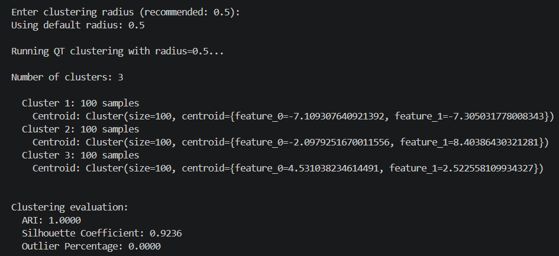
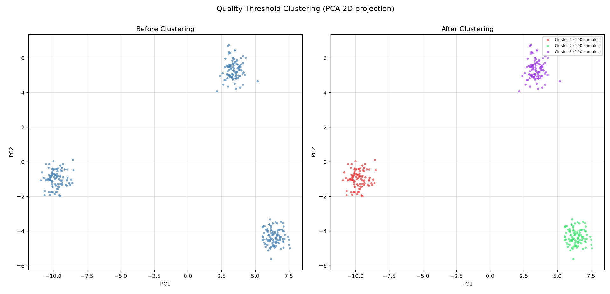

# Model Evaluation

Here is a summary of the evaluation metrics used by the system to assess the quality of the produced clusters.

## Adjusted Rand Index (ARI)
The Adjusted Rand Index measures how well the clusters found by the algorithm match a set of ground truth labels. A value close to 1 means the grouping is almost identical to the expected one, while a value near 0 indicates a random grouping:

$$\text{ARI} = \frac{ \sum_{ij} \binom{n_{ij}}{2} - \left[ \sum_i \binom{a_i}{2} \sum_j \binom{b_j}{2} \right] / \binom{n}{2} }{ \frac{1}{2} \left[ \sum_i \binom{a_i}{2} + \sum_j \binom{b_j}{2} \right] - \left[ \sum_i \binom{a_i}{2} \sum_j \binom{b_j}{2} \right] / \binom{n}{2} }$$

**Where:**

* **$n_{ij}$**: The number of objects shared between cluster $i$ of ground truth $U$ and cluster $j$ of predicted clustering $V$ (elements in the contingency table).
* **$a_i = \sum_j n_{ij}$**: The sum of elements in row $i$ (total elements in ground truth cluster $i$).
* **$b_j = \sum_i n_{ij}$**: The sum of elements in column $j$ (total elements in predicted cluster $j$).
* **$\binom{n}{2} = \frac{n(n-1)}{2}$**: The total number of possible pairs from $n$ total data points.
* **$\binom{x}{2} = \frac{x(x-1)}{2}$**: The binomial coefficient representing the number of pairs that can be formed from $x$ elements.

## Silhouette Coefficient
The Silhouette Coefficient measures how compact and well-separated the clusters are, without needing ground truth. Values range from -1 to 1: a high value means each cluster is made of similar points far from the other clusters, while a low value suggests overlapping or poorly separated groups:

$$s(i) = \frac{b(i) - a(i)}{\max(a(i), b(i))}$$

**Where:**

* **$a(i)$**: The mean intra-cluster distance, representing the average distance between point $i$ and all other data points within the same cluster (cluster cohesion).
* **$b(i)$**: The mean nearest-cluster distance, representing the average distance between point $i$ and all points in the nearest neighboring cluster to which $i$ does not belong (cluster separation).
* **$\max(a(i), b(i))$**: A normalization factor that ensures the value of $s(i)$ falls strictly within the range $[-1, 1]$.

The overall **Silhouette Coefficient** for the entire dataset is the mean $s(i)$ score across all $N$ data points:

$$S = \frac{1}{N} \sum_{i=1}^{N} s(i)$$

* **$N$**: The total number of data points in the dataset.

## Outlier Percentage
The Outlier Percentage is the fraction of data points that end up isolated in a cluster of their own (singleton clusters). A high value indicates that many points could not be grouped with any other point, which can happen when the clustering radius is too small:

$$ \text{Outlier Percentage \%)} = \left( \frac{N_{\text{outliers}}}{N_{\text{total}}} \right) \times 100 $$

**Where:**

* **$N_{\text{outliers}}$**: The number of data points classified as outliers or noise.
* **$N_{\text{total}}$**: The total number of data points in the dataset.

---

I chose radius=0.5 as the default, because it is the one with which the system obtains the best results:

